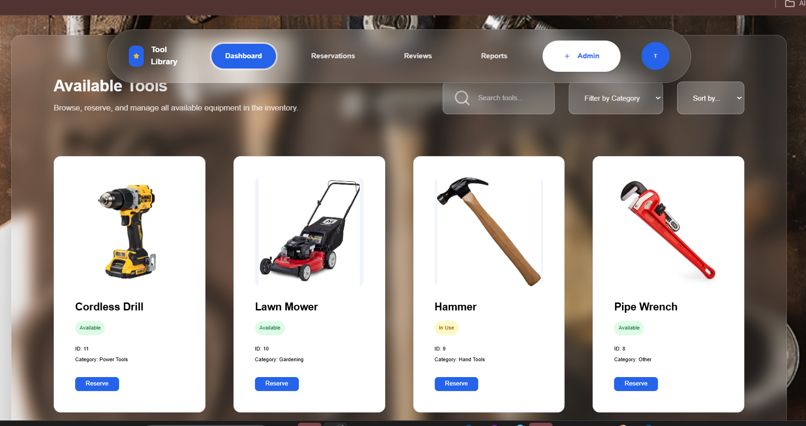
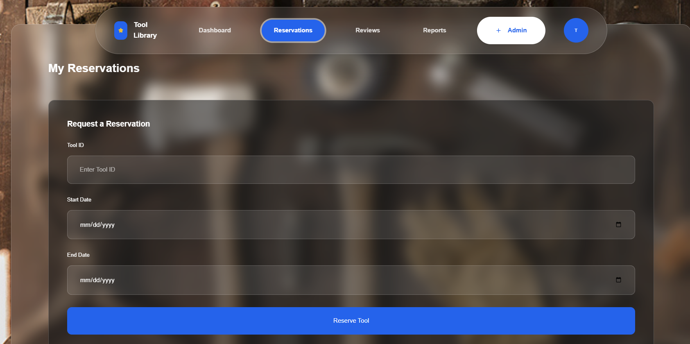
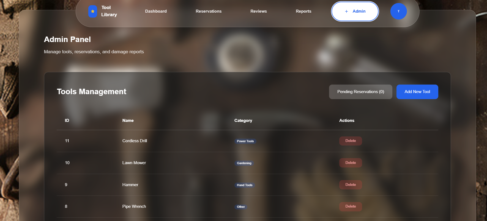

# Neighborhood Tool Library

A full-stack web application for managing a community tool-sharing library. Members can browse available tools, make reservations, and report damages, while admins can manage tools, approve reservations, and handle reports.

## 🚀 Live Links

- **Frontend**: [https://neighborhood-tool-library-1.onrender.com](https://neighborhood-tool-library-1.onrender.com)
- **Backend API**: [https://neighborhood-tool-library.onrender.com](https://neighborhood-tool-library.onrender.com)

## 📋 Project Overview

### Core Features

- **User Authentication**: Secure login/registration with JWT tokens
- **Tool Management**: Browse, add, and manage community tools with images
- **Reservations**: Request tool reservations with admin approval workflow
- **Admin Panel**: Comprehensive dashboard for managing tools, reservations, and reports
- **Damage Reports**: Users can report tool damage with optional images
- **Reviews**: Community feedback system for tools
- **Responsive Design**: Mobile-first UI built with React and Tailwind CSS

### Technology Stack

- **Frontend**: React 19, Vite, Tailwind CSS, React Router, Axios
- **Backend**: Node.js, Express.js, PostgreSQL, JWT Authentication
- **Deployment**: Vercel (frontend), Render (backend), Docker containers
- **Image Storage**: Cloudinary integration

## 🖼️ Visual Showcase

### Available Tools Page


### Reservation Page


### Admin Panel


## 🛠️ Local Setup Instructions

### Prerequisites

- Docker and Docker Compose
- Node.js 18+ (for local development without Docker)
- Git

### Quick Start with Docker Compose

1. **Clone the repository**:
   ```bash
   git clone <repository-url>
   cd neighborhood-tool-library
   ```

2. **Create environment file for backend**:
   Create `server/.env` file with the following variables:
   ```env
   JWT_SECRET=your-super-secret-jwt-key-here
   CLOUDINARY_CLOUD_NAME=your-cloudinary-cloud-name
   CLOUDINARY_API_KEY=your-cloudinary-api-key
   CLOUDINARY_API_SECRET=your-cloudinary-api-secret
   ```

3. **Start all services**:
   ```bash
   docker-compose up --build
   ```

4. **Access the application**:
   - Frontend: http://localhost:3000
   - Backend API: http://localhost:5000
   - Database: localhost:5432 (accessible via Docker)

### Manual Setup (Without Docker)

1. **Database Setup**:
   - Install PostgreSQL locally
   - Create database: `tool_library`
   - Run the schema from `database/schema.sql`

2. **Backend Setup**:
   ```bash
   cd server
   npm install
   # Create .env file as shown above
   npm start
   ```

3. **Frontend Setup**:
   ```bash
   cd client
   npm install
   npm run dev
   ```

## 📚 API Documentation

### Authentication Endpoints

#### POST /api/auth/register
Register a new user account.

**Request Body:**
```json
{
  "name": "John Doe",
  "email": "john@example.com",
  "password": "securepassword",
  "role": "member"
}
```

**Response (201):**
```json
{
  "user": {
    "id": 1,
    "name": "John Doe",
    "email": "john@example.com",
    "role": "member"
  }
}
```

#### POST /api/auth/login
Authenticate user and receive JWT token.

**Request Body:**
```json
{
  "email": "john@example.com",
  "password": "securepassword"
}
```

**Response (200):**
```json
{
  "token": "jwt-token-here",
  "user": {
    "id": 1,
    "name": "John Doe",
    "email": "john@example.com",
    "role": "member"
  }
}
```

#### POST /api/auth/forgot-password
Initiate password reset process.

**Request Body:**
```json
{
  "email": "john@example.com"
}
```

**Response (200):**
```json
{
  "message": "If an account with that email exists, password reset instructions have been sent."
}
```

#### GET /api/auth/verify
Verify JWT token and get current user info.

**Headers:**
```
Authorization: Bearer <jwt-token>
```

**Response (200):**
```json
{
  "user": {
    "id": 1,
    "name": "John Doe",
    "email": "john@example.com",
    "role": "member"
  }
}
```

### Tool Management Endpoints

#### GET /api/tools
Get all tools with their current availability status.

**Response (200):**
```json
[
  {
    "id": 1,
    "name": "Hammer",
    "description": "16oz claw hammer",
    "category": "Hand Tools",
    "image_url": "/uploads/hammer.jpg",
    "status": "Available"
  }
]
```

#### POST /api/tools
Create a new tool (Admin only).

**Headers:**
```
Authorization: Bearer <jwt-token>
Content-Type: multipart/form-data
```

**Request Body (Form Data):**
- `name`: Tool name
- `description`: Tool description
- `category`: Tool category
- `image`: Image file (optional)

**Response (201):**
```json
{
  "id": 1,
  "name": "Hammer",
  "description": "16oz claw hammer",
  "category": "Hand Tools",
  "image_url": "/uploads/hammer.jpg",
  "admin_id": 1
}
```

#### DELETE /api/tools/:id
Delete a tool (Admin only).

**Headers:**
```
Authorization: Bearer <jwt-token>
```

**Response (200):**
```json
{
  "message": "Tool deleted"
}
```

### Reservation Endpoints

#### POST /api/reservations
Create a new reservation request.

**Headers:**
```
Authorization: Bearer <jwt-token>
```

**Request Body:**
```json
{
  "tool_id": 1,
  "start_date": "2024-01-15",
  "end_date": "2024-01-20"
}
```

**Response (201):**
```json
{
  "id": 1,
  "tool_id": 1,
  "user_id": 2,
  "start_date": "2024-01-15",
  "end_date": "2024-01-20",
  "status": "pending"
}
```

#### GET /api/reservations
Get user's reservations.

**Headers:**
```
Authorization: Bearer <jwt-token>
```

**Response (200):**
```json
[
  {
    "id": 1,
    "tool_id": 1,
    "tool_name": "Hammer",
    "start_date": "2024-01-15",
    "end_date": "2024-01-20",
    "status": "approved"
  }
]
```

#### PATCH /api/reservations/:id/status
Update reservation status (Admin only).

**Headers:**
```
Authorization: Bearer <jwt-token>
```

**Request Body:**
```json
{
  "status": "approved"
}
```

**Response (200):**
```json
{
  "id": 1,
  "tool_id": 1,
  "user_id": 2,
  "start_date": "2024-01-15",
  "end_date": "2024-01-20",
  "status": "approved",
  "approved_at": "2024-01-10T10:00:00Z",
  "approved_by": 1
}
```

#### PATCH /api/reservations/:id/return
Return a tool (close reservation).

**Headers:**
```
Authorization: Bearer <jwt-token>
```

**Response (200):**
```json
{
  "id": 1,
  "tool_id": 1,
  "user_id": 2,
  "start_date": "2024-01-15",
  "end_date": "2024-01-20",
  "status": "closed"
}
```

#### GET /api/reservations/pending
Get pending reservations (Admin only).

**Headers:**
```
Authorization: Bearer <jwt-token>
```

**Response (200):**
```json
[
  {
    "id": 1,
    "tool_id": 1,
    "tool_name": "Hammer",
    "user_name": "John Doe",
    "user_email": "john@example.com",
    "start_date": "2024-01-15",
    "end_date": "2024-01-20",
    "status": "pending"
  }
]
```

### Damage Reports Endpoints

#### POST /api/reports
Submit a damage report.

**Headers:**
```
Authorization: Bearer <jwt-token>
Content-Type: multipart/form-data
```

**Request Body (Form Data):**
- `tool_id`: Tool ID
- `description`: Damage description
- `image`: Image file (optional)

**Response (201):**
```json
{
  "id": 1,
  "tool_id": 1,
  "user_id": 2,
  "description": "Handle is cracked",
  "image_url": "/uploads/damage.jpg",
  "resolved": false
}
```

#### GET /api/reports
Get all damage reports (Admin only).

**Headers:**
```
Authorization: Bearer <jwt-token>
```

**Response (200):**
```json
[
  {
    "id": 1,
    "tool_id": 1,
    "tool_name": "Hammer",
    "user_id": 2,
    "reporter": "John Doe",
    "description": "Handle is cracked",
    "image_url": "/uploads/damage.jpg",
    "resolved": false,
    "created_at": "2024-01-10T10:00:00Z"
  }
]
```

#### PATCH /api/reports/:id/resolve
Mark a report as resolved (Admin only).

**Headers:**
```
Authorization: Bearer <jwt-token>
```

**Response (200):**
```json
{
  "id": 1,
  "tool_id": 1,
  "user_id": 2,
  "description": "Handle is cracked",
  "image_url": "/uploads/damage.jpg",
  "resolved": true
}
```

### Reviews Endpoints

#### POST /api/reviews
Add a review for a tool.

**Headers:**
```
Authorization: Bearer <jwt-token>
```

**Request Body:**
```json
{
  "tool_id": 1,
  "rating": 5,
  "comment": "Great tool, works perfectly!"
}
```

**Response (201):**
```json
{
  "id": 1,
  "tool_id": 1,
  "user_id": 2,
  "rating": 5,
  "comment": "Great tool, works perfectly!"
}
```

#### GET /api/reviews/:tool_id
Get all reviews for a specific tool.

**Response (200):**
```json
[
  {
    "id": 1,
    "rating": 5,
    "comment": "Great tool, works perfectly!",
    "user_id": 2,
    "user_name": "John Doe"
  }
]
```


## 📄 License

This project is licensed under the MIT License - see the [LICENSE](LICENSE) file for details.

## 📞 Support

For questions or support, please open an issue on GitHub or contact the development team.

